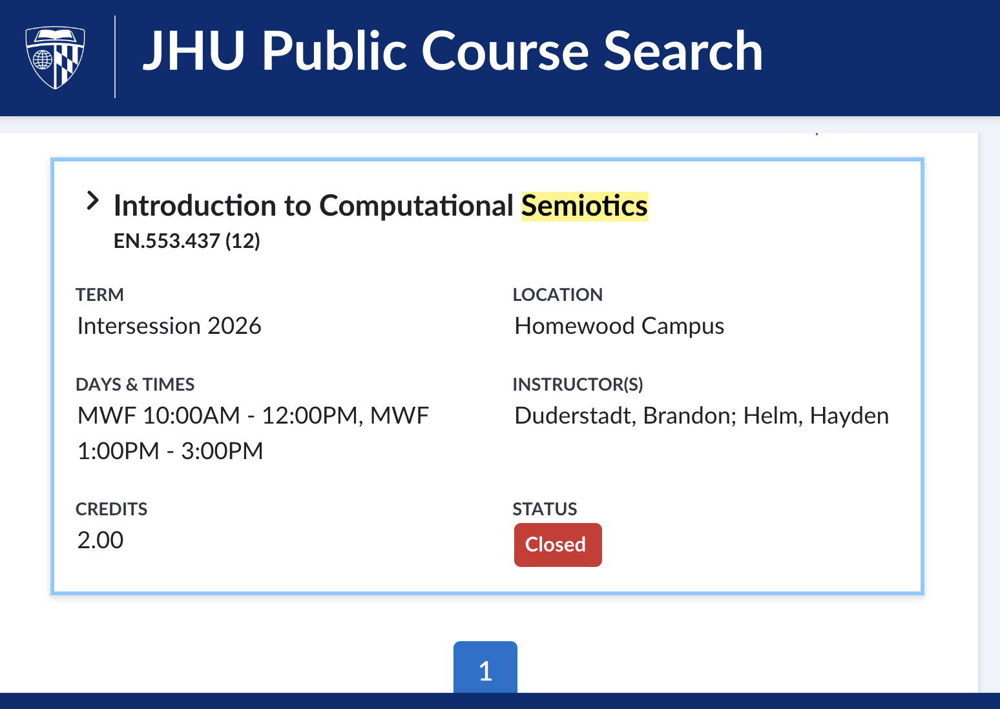

# News & History

**January 5, 2026**

The first ever "memetics class" with the new paradigm is taught at a legitimate academic institution. The class is at Johns Hopkins, taught by Brandon Duderstadt. 

[https://courses.jhu.edu/?query=semiotics&terms=Intersession+2026](https://courses.jhu.edu/?query=semiotics&terms=Intersession+2026)

> Computational semiotics explores the study of interpretation, meaning-making, and sign processes in an era of artificial intelligence and digital culture. This course will introduce the field and prepare students to contribute directly to the ongoing computational semiotics research across the Johns Hopkins University ecosystem. We will begin by surveying classical theories of meaning, progress to quantitative methods for studying meaning, and conclude with a review of relevant contemporary publications. Students will learn about topics including neural embedding models, dimensionality reduction, and systems of interacting language models, as well as gain hands on experience working with large scale datasets of internet discourse on TikTok and X (Twitter). Familiarity with linear algebra and Python is helpful but not required.

----

TODO document the "twitter spikes" thing which I think was a big formative moment?

- April 6, 2025, https://x.com/DefenderOfBasic/status/1908957396371997182

----

**April 25, 2025** 

University of Zurich scandal. This was the first time the "open-closed" research gap went mainstream. Demonstrating to the world the need for open memetics. 

See ["Researchers Secretly Ran a Massive, Unauthorized AI Persuasion Experiment on Reddit Users"](https://www.404media.co/researchers-secretly-ran-a-massive-unauthorized-ai-persuasion-experiment-on-reddit-users/)

> The researchers argue that psychological manipulation of OPs on this sub is justified because the lack of existing field experiments constitutes an unacceptable gap in the body of knowledge.
>
> [source: the r/ChangeMyView announcement that broke the news](https://www.reddit.com/r/changemyview/comments/1k8b2hj/meta_unauthorized_experiment_on_cmv_involving/)

-----

?????

-----

**Prehistory** 

At the beginning of mass media, people just put things on TV. Then they realized that, if a character in a TV show drinks milk from a certain brand, a hundred thousand people all over the country go buy that the next day because they love the character.

This accidentally enriched some people, and accidentally destroyed other companies. Everyone said _"oh shit, we should be more careful"_. Others said _"wait, this is extremely useful, don't tell people this is possible, let's just do things and see if we can people to behave how we want_"

Then came a long period of dark memetic warfare. Until enough people started to understand how the game works, and began to pay attention, and become "live players" themselves.

The playing field continues to evolve...